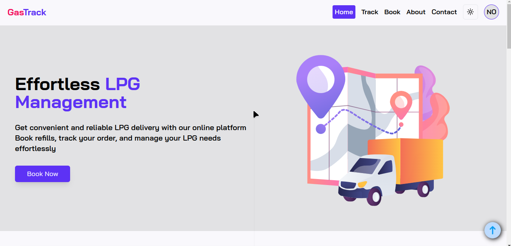
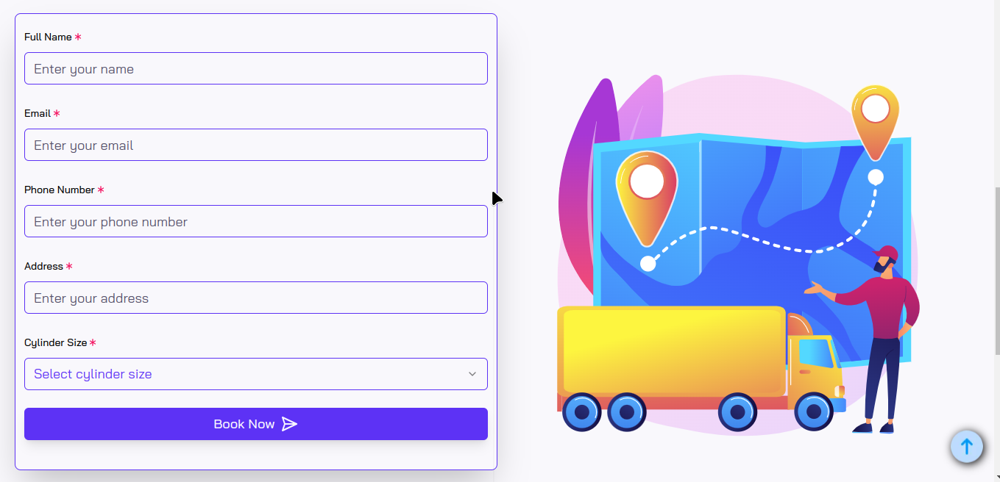
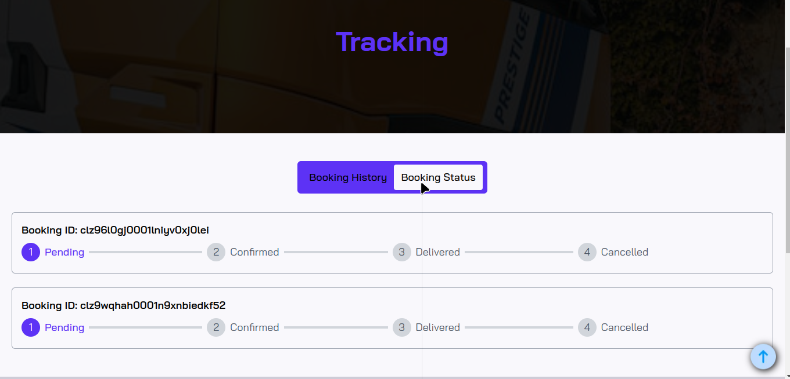
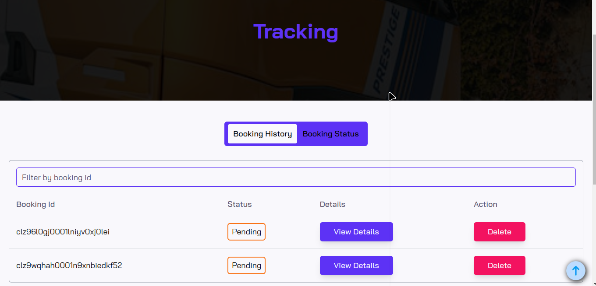
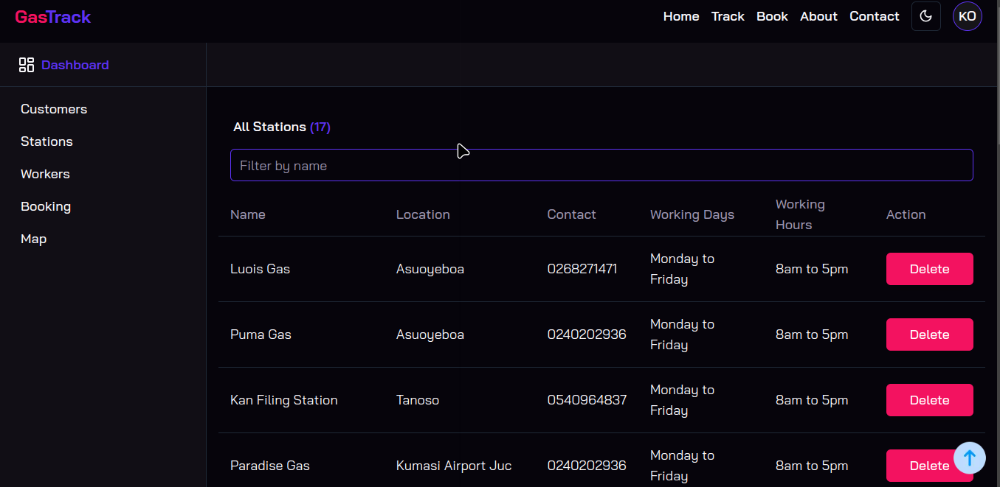

# GasTrack

## Table of Contents

- [Introduction](#introduction)
- [Features](#features)
- [Technology Stack](#technology-stack)
- [Screenshots](#screenshots)
- [Contact](#contact)

## Introduction

GasTrack is a comprehensive web application designed to streamline the management of LPG (liquefied petroleum gas) refills. Built with modern web technologies, GasTrack enables users to book refills, track their orders in real-time, and ensure a safe and reliable LPG delivery experience. With an intuitive interface and robust backend, GasTrack caters to both users and administrators, providing a seamless experience for all.

## Features

### For Users

- **Book LPG Refills**: Easily schedule and book LPG refills with a user-friendly interface.
- **Track Orders**: Monitor the status of your LPG refills in real-time.
- **Profile Management**: Update and manage your profile information with ease.
- **Status Tracking**: View the current status of your LPG refill, including Pending, Confirmed, Delivered, and Cancelled statuses.
- **Download Booking as PDF**: Download your booking details as a PDF file, which includes a unique QR code for easy reference.
- **Dark Mode**: Enjoy a dark mode for a better viewing experience in low-light environments.
- **Responsive Design**: Fully responsive design ensures a smooth experience across all devices, from mobile to desktop.

### For Administrators

- **Admin Dashboard**: Access a comprehensive dashboard to manage users, bookings, and LPG stations.
- **CRUD Operations**: Perform Create, Read, Update, and Delete operations on bookings, users, and stations.
- **Map Integration**: View and manage LPG stations on an interactive map using Leaflet.
- **Booking Status Management**: Update and manage the status of user bookings.
- **Booking Notification**: Receive an email with booking details to update the status of the booking.

## Technology Stack

- **Frontend**: Next.js, Shadcn, TypeScript
- **Backend**: Prisma, Neon Postgres Database
- **Mapping**: Leaflet
- **Authentication**: Kinde Auth
- **Server Actions**: Next.js Server Actions
- **PDF Generation**: For downloading bookings as PDFs
- **QR Code Generation**: Includes QR codes for booking IDs

## Screenshots

## Contact

If you want to get in touch, you can reach me at [kendrickoppong94@gmail.com](mailto:kendrickoppong94@gmail.com).
